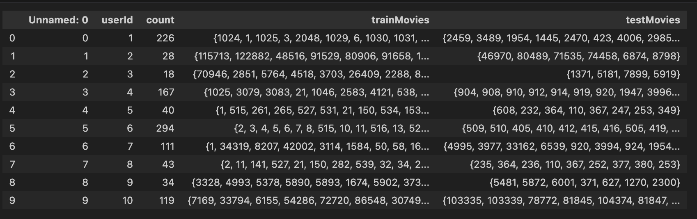
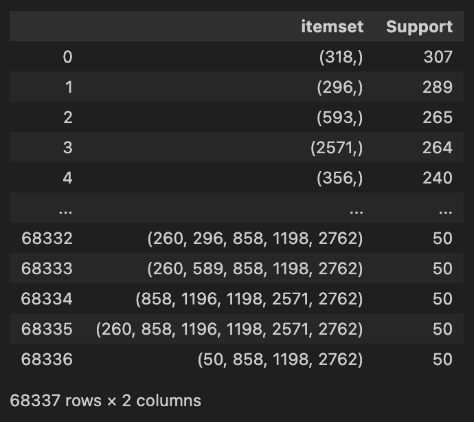
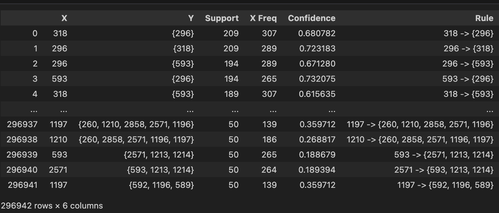
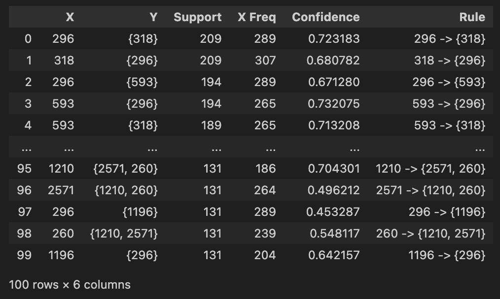
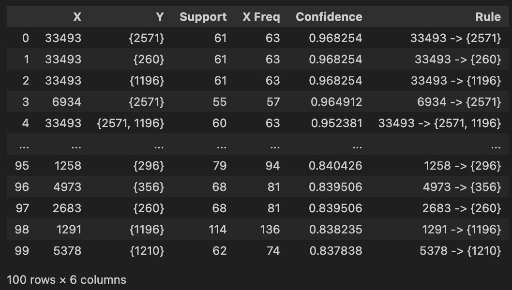
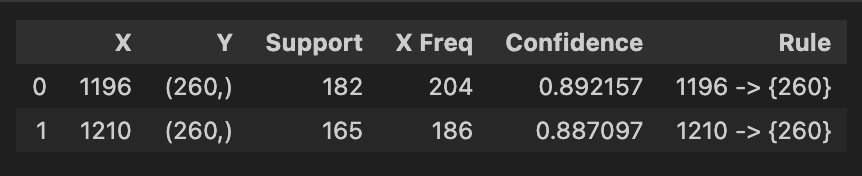
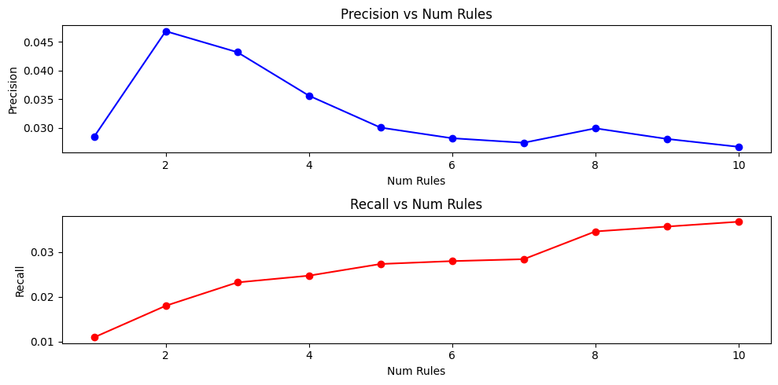
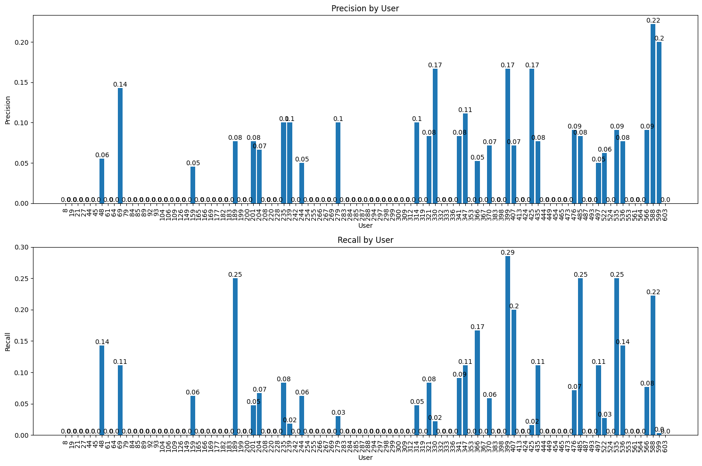

# Data Analytics 
# Assignment 3 - Association Rule Mining
# TEAM - 3
```
Abhinav Reddy Boddu - 2021101034
Gowlapalli Rohit - 2021101113
```
# Justification for Choosing FP-Growth

- **Efficiency**: The FP-Growth approach is generally more efficient than Apriori, particularly for large datasets. It reduces the need for repeated database scans, making it faster for frequent pattern mining.

- **Reduced Candidate Generation**: Apriori generates a large number of candidate itemsets, many of which may not be frequent. In contrast, FP-Growth significantly reduces candidate generation by compactly storing transactions in a tree structure.

- **Memory Efficiency**: FP-Growth is often more memory-efficient because it compresses the dataset into an FP-Tree, avoiding the need for maintaining a large list of itemsets as Apriori does.

- **Single Dataset Scan**: FP-Growth requires only a single pass over the dataset to build the FP-Tree and count item frequencies, making it ideal for scenarios where multiple scans of the database are costly or infeasible.

- **Reduced Computation**: Apriori generates and evaluates many candidate itemsets, leading to higher computational overhead. FP-Growth reduces the number of itemsets that need to be considered, leading to faster computations.

- **Easier Rule Generation**: FP-Growth simplifies the process of generating association rules, as it maintains direct information about the support of individual itemsets within the tree.

# FP-Growth Algorithm Implementation

### Dataset Description
The dataset provided includes 100,836 ratings and 3,683 tag applications across 9,742 movies. It captures user ratings using a 5-star rating system from the MovieLens movie recommendation service.

**Data Files**:
- **ratings.csv**: Contains user ratings. Each entry includes `userId`, `movieId`, `rating`, and `timestamp`.
- **movies.csv**: Contains movie information. Each entry includes `movieId`, `title`, and `genre`.

### Assignment Tasks
#### Data Preprocessing
1. **Forming the Transactional Dataset**:
   Create a dataset consisting of entries in the form ⟨user id, {movies rated above 2}⟩. Only consider users with more than 10 movie ratings. Drop the `timestamp` field from the `ratings.csv`.

```python
import pandas as pd

# Load datasets
ratings_df = pd.read_csv('ratings.csv')
movies_df = pd.read_csv('movies.csv')

# Drop 'timestamp' column and filter out ratings <= 2
ratings_df = ratings_df.drop(labels=['timestamp'], axis=1)
ratings_df = ratings_df[ratings_df['rating'] > 2]

# Keep users with more than 10 ratings
user_counts = pd.DataFrame(ratings_df['userId'].value_counts().sort_values())
active_users = user_counts[user_counts['userId'] > 10].index
ratings_df = ratings_df[ratings_df['userId'].isin(active_users)]

# Group ratings by 'userId' and list movieIds for each user
transactions = ratings_df.groupby('userId')['movieId'].apply(lambda x: (list(set(x)), len(x))).reset_index()

# Split 'movieId' into 'movies' and 'count' columns
transactions[['movies', 'count']] = pd.DataFrame(transactions['movieId'].tolist(), index=transactions.index)
transactions.drop(columns=['movieId'], inplace=True)
```

#### Association Rule Mining:
   1. **Splitting Movies into Training and Testing**:
   Split each user's movie set into training (80%) and testing (20%) sets.

```python
import json

def split_movies(movies, test_size=0.2):
    movies = json.loads(movies)
    split_idx = int(len(movies) * (1 - test_size))
    train_movies = set(movies[:split_idx])
    test_movies = set(movies[split_idx:])
    return (train_movies, test_movies)

transactions[['trainMovies', 'testMovies']] = transactions['movies'].apply(lambda movies: pd.Series(split_movies(movies)))
```


   2. **Mining Frequent Patterns using FP-Growth:**:
    Implement the FP-Growth algorithm to mine frequent itemsets from the training dataset.
```python
class FPNode:
    def __init__(self, item, count, parent):
        self.item = item
        self.parent = parent
        self.children = {}
        self.link = None
        self.count = count

    def increment(self, count):
        self.count += count

    def pretty_print(self):
        print(f'({self.item}-{self.count})[', end='')
        for child in self.children.values():
            child.pretty_print()
        print('],', end='')


class FPTreeBase:
    def __init__(self, transactions, freq_1_itemsets, min_sup):
        self.transactions = transactions
        self.freq_1_itemsets = freq_1_itemsets
        self.min_sup = min_sup
        self.header_table = defaultdict(list)
        self.root = None

    def _build_tree(self):
        root = FPNode(None, 1, None)
        for transaction in self.transactions:
            self._insert_transaction(root, transaction)
        self.root = root
        return root

    def _insert_transaction(self, node, transaction):
        if len(transaction) == 0:
            return

        first_item, freq = transaction[0]
        if first_item in node.children:
            node.children[first_item].increment(freq)
        else:
            new_node = FPNode(first_item, freq, node)
            node.children[first_item] = new_node
            self.header_table[first_item].append(new_node)

        remaining_tr = transaction[1:]
        self._insert_transaction(node.children[first_item], remaining_tr)

    def mine_patterns(self, depth=0):
        patterns = {}
        for item in reversed(self.freq_1_itemsets):
            if item not in self.header_table:
                continue
            conditional_patterns = []
            for node in self.header_table[item]:
                path = self._prefix_path(node)
                if path:
                    conditional_patterns.append([[p, node.count] for p in path])

            leaf_item_freq = defaultdict(int)
            for pattern in conditional_patterns:
                for node, freq in pattern:
                    leaf_item_freq[node] += freq

            leaf_item_freq = {k: v for k, v in leaf_item_freq.items() if v >= self.min_sup}
            filtered_patterns = [list(filter(lambda p: p[0] in leaf_item_freq, pattern)) for pattern in conditional_patterns]

            for pattern in filtered_patterns:
                temp = []
                for node, freq in pattern:
                    temp.append([node, freq])

            if len(conditional_patterns) == 1 and conditional_patterns[0][0][1] >= self.min_sup:
                patterns[tuple(sorted([node for node, freq in conditional_patterns[0]]))] = conditional_patterns[0][0][1]
        return patterns
```



>* **Generating Association Rules**:
   After mining frequent patterns, generate association rules and sort them by support and confidence.
```python
import ast

# Read patterns and transform 'movies' column
patterns = pd.read_csv('frequent-itemsets.csv')
patterns['movies'] = patterns['itemset'].apply(lambda x: set(ast.literal_eval(x)))

association_df = []

for _, row in patterns.iterrows():
    support, movies = row
    if len(movies) > 1:
        for mv in movies:
            X = mv
            Y = movies.copy()
            Y.discard(X)
            association_df.append([X, Y, support])

association_df = pd.DataFrame(association_df, columns=['X', 'Y', 'Support'])

# Merge with frequency of itemsets and compute confidence
freq_1_df = pd.read_csv('1-itemset-frequency.csv')
freq_1_df['X'] = freq_1_df['mId']
association_df = pd.merge(association_df, freq_1_df, on='X', how='left')
association_df['Confidence'] = association_df['Support'] / association_df['X Freq']

# Filter based on minimum confidence
association_df = association_df[association_df['Confidence'] >= 0.1]
association_df['Rule'] = association_df['X'].astype(str) + ' -> ' + association_df['Y'].apply(lambda y: str(y))

# Save top 100 rules based on support and confidence
support_sorted_df = association_df.sort_values(by='Support', ascending=False).head(100)
confidence_sorted_df = association_df.sort_values(by='Confidence', ascending=False).head(100)

support_sorted_df.to_csv('support_sorted_top_100.csv', index=False, encoding='utf-8')
confidence_sorted_df.to_csv('confidence_sorted_top_100.csv', index=False, encoding='utf-8')
```


#### The initial list includes the top 100 association rules, arranged in order of their support


#### The second list comprises the top 100 rules, prioritizing them according to confidence.


#### The rules that appear in both the lists arranged based on their confidence score


## Evaluation Metrics

   1. **Precision**:  
   Precision measures the accuracy of the recommendations. It answers the question:  
   "Of all the items we recommended, how many are relevant?"  
   
   Precision is calculated as:

   $$
   \text{Precision} = \frac{\text{Number of relevant items recommended}}{\text{Total number of items recommended}}
   $$

   Precision decreases when there are more false positives, meaning more items that are recommended but are not actually relevant. In other words, if the recommendations include more irrelevant items, precision decreases.

   2. **Recall**:  
   Recall measures the coverage of relevant items. It answers the question:  
   "Of all the relevant items, how many were successfully recommended?"  

   Recall is calculated as:

   $$
   \text{Recall} = \frac{\text{Number of relevant items recommended}}{\text{Total number of relevant items}}
   $$

   Recall increases as we receive more relevant recommendations. As the number of recommended items (K) increases, the system captures a larger portion of the relevant items.


   3.  **Recommendation and Evaluation**:

For each user in the test set, we selected association rules X→Y, where X corresponds to a movie from the training set. The set Y represents the recommended movies. To evaluate the recommendation system, we computed the average precision and recall metrics. We varied the number of rules considered from 1 to 10. 

#### Inferences from Precision and Recall vs Num Rules

1. **Precision vs Num Rules**:
   - Initially, as the number of rules increases from 1 to 2, there is a sharp rise in precision, peaking at around 0.045.
   - After reaching the peak at 2 rules, precision steadily declines as the number of rules increases further, indicating diminishing accuracy in recommendations.
   - This trend suggests that a small number of rules is sufficient for maintaining high precision, but adding more rules leads to a higher number of false positives, reducing precision.

2. **Recall vs Num Rules**:
   - Recall shows a gradual and steady increase as the number of rules increases, moving from 0.01 at 1 rule to approximately 0.03 at 10 rules.
   - This indicates that as more rules are applied, the system is able to capture more relevant items, improving the recall metric.
   - However, the increase in recall tends to flatten after reaching 8 rules, suggesting that beyond a certain point, adding more rules does not significantly improve the coverage of relevant items.

##### Overall Observation:
- **Trade-off between Precision and Recall**: The graph highlights a typical trade-off between precision and recall. Increasing the number of rules improves recall but negatively impacts precision, implying that more recommendations capture a larger portion of relevant items but also include more irrelevant items.




4. **Sample User Analysis**:
   To gain a deeper understanding of the system's performance, we selected a sample of users from the test set and examined their precision and recall values. The results were plotted as precision and recall graphs for the sample users.

#### Inferences from Precision and Recall by User

#### Precision by User:
   1. **Variation in Precision**: The precision scores vary significantly across users. Some users exhibit relatively high precision, such as:
   - User 69 with 0.14
   - User 239 with 0.10
   - User 330 with 0.17
   - User 588 with 0.22

   On the other hand, a large number of users have a precision of 0, indicating that no relevant items were recommended for them.

1. **High Precision Users**: The highest precision observed is 0.22 (User 59), suggesting that for this user, a good proportion of recommended items were relevant. Other users like 69, 239, 330, and 588 also performed well in terms of precision.

2. **Low Precision Users**: Many users, particularly those between Users 8 to 45, 283 to 312, and 444 to 473, have precision scores of 0, implying that irrelevant recommendations were predominantly made for these users.

#### Recall by User:
   1. **Variation in Recall**: Similar to precision, recall scores also show wide variability among users. Some users, particularly:
   - User 48 with 0.14
   - User 189 with 0.25
   - User 399 with 0.29
   - User 588 with 0.22

   exhibit higher recall, indicating that a larger portion of the relevant items was successfully recommended to them.

1. **High Recall Users**: The highest recall value observed is 0.29 (User 399), meaning that nearly 30% of the relevant items for this user were recommended. Users 189 and 588 also exhibit relatively high recall values.

2. **Low Recall Users**: Similar to precision, many users have recall values of 0, implying that no relevant items were recommended for these users. This is especially prominent in Users 79 to 149, 283 to 312, and 444 to 473.

##### Overall Observations:
- **Disparity in Recommendation Performance**: There is a significant disparity in how well recommendations perform across users. Some users see a high level of precision and recall, while many others do not receive relevant recommendations.
- **Correlation Between Precision and Recall**: Users who have higher precision generally also exhibit higher recall, suggesting that when the system recommends relevant items for a user, it tends to recommend more of them.
- **Improvement Areas**: A significant number of users have both precision and recall values of 0, highlighting the need to improve the recommendation system for these users to make the predictions more relevant and effective.

